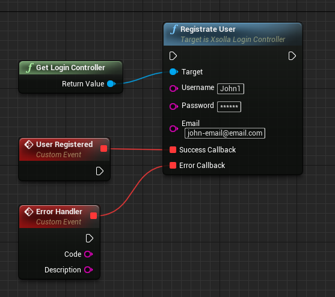
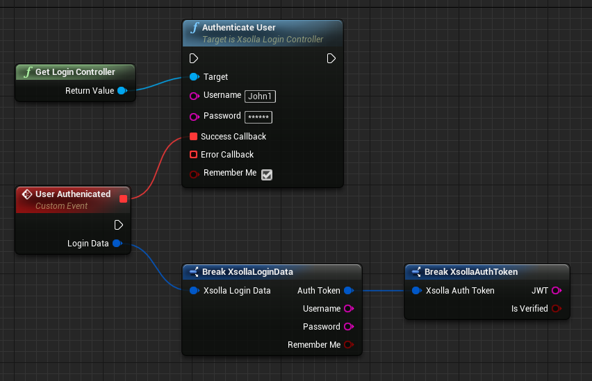
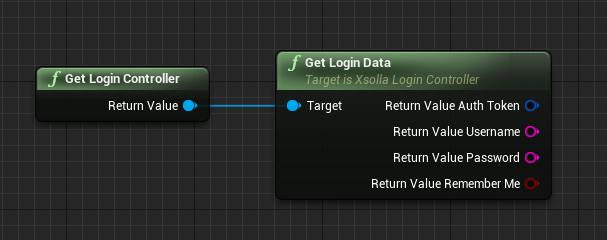
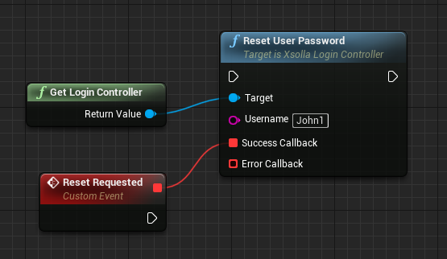
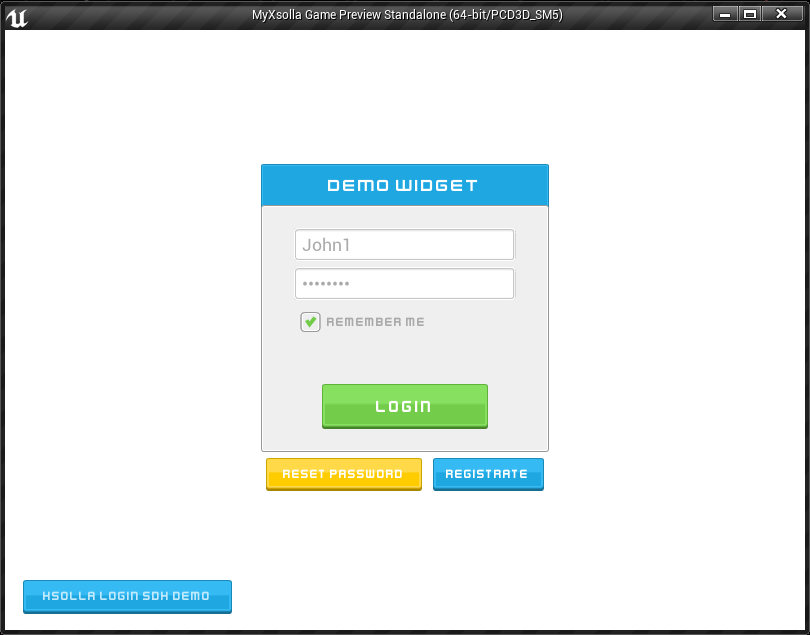

# Xsolla Login SDK UE4

Development repository for the Xsolla Login SDK for Unreal Engine 4 platforms.

## Overview

[Login](https://xsolla.com/products/login) is a single sign-on tool that authenticates and secures user passwords on behalf of partners who develop video games. Please check [Login API Documentation](https://developers.xsolla.com/doc/login/) for full integration info.

## Installation

1. Download the **plugin source** from the [latest release](https://github.com/xsolla/login-ue4-sdk/releases).
1. Make a **Plugins/XsollaLogin** folder under your game project directory and copy plugin source into it.
1. Compile your game project normally. Unreal Build Tool will detect the plugins and compile them as dependencies to your game.
1. Launch the editor.
1. Go to `Project Settings -> Plugins -> Xsolla Login SDK` and set `Project Id` as **Login ID** from Publisher Account.

## How To

### Registrate User

Adds a new user to the database. The user will receive an account confirmation message to the specified e-mail.

### Authentication by Username and Password

Authenticates the user by the username and password specified.

### Use Login Data

Once user is athenicated the login data is stored in XsollaLoginController. Use `GetLoginData()` function to get access to it.

If `RememberMe` option was set the login data will be saved locally and loaded from cache once app is started. No manual data save is required.

### User Password Reset

Resets the user's password.

## Plugin Demo

Check the **<XsollaLogin Content>/Maps/Demo** example with plugin usage widget demo inside.

## JWT Validation

A [JWT](https://jwt.io/introduction/) signed by the secret key is generated for each successfully authenticated user. To make sure that the JWT has not expired and belongs to the user in your project, you need to validate its value. 

Validation is optional for client-side, but required for server-side usage (f.e. for in-app pushaces confirmation). See [TokenVerificator](https://github.com/xsolla/login-ue4-sdk/tree/develop/Extras/TokenVerificator) example.

To enable auto-validation of the JWT on the client-side just set the `VerifyTokenURL` parameter with your server validation url, and it will be validated on user login event.

